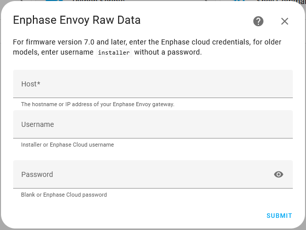

[](https://github.com/hacs/integration#readme)


# Enphase Envoy raw data

This is a Home Assistant custom integration for [Enphase Envoy/IQ Gateway](https://enphase.com/en-us/products-and-services/envoy-and-combiner). 
It provides 2 service actions to access Enphase IQ Gateway raw data:

- read_data: GET request to the Envoy
- send_data: PUT/POST request to the Envoy

> [!CAUTION]
> ⚠️ Sending PUT/POST requests to the Envoy is at your own risk! Only use this service action if you fully understand the required data format, the effect on the Envoy/IQ Gateway and accept the risk of potential negative impact on the Envoy operation. Also be aware that each new firmware pushed to your Envoy/IQ Gateway may expose different behavior and PUT/POST request effects may suddenly change. ⚠️

This integration provides no entities, for entities use the core [HA Core integration](https://www.home-assistant.io/integrations/enphase_envoy/) or another custom integration. It does **NOT** replace the core integration, both can be used at the same time. The intent is to provide additional specialized and more rarely used service actions which are not present in the core integration. It can run without the core integration, but the core integration would be needed to provide the [typical Envoy entities](https://www.home-assistant.io/integrations/enphase_envoy/#capabilities). 

Under the hood, this custom integration is a stripped down fork of the HA core integration and it is using the same [pyenphase library](https://pypi.org/project/pyenphase/) for communication to the Enphase Envoy/IQ Gateway. Entity creation, scheduled data collection and auto detection are removed. Each Envoy needs to be added manually. Token handling and refresh for firmware version 7.0 and later is retained.

<details>  
<summary>Installation</summary>

## Installation

As with all Home Assistant configuration changes, first make appropriate backups of you Home Assistant installation and data.

### Using HACS

1. Install [HACS](https://hacs.xyz/) if you haven't already
3. Add this GITHUB repository as a [custom integration repository](https://hacs.xyz/docs/faq/custom_repositories) to HACS
5. Go to the HACS Integrations page in HA, select this custom repository and download the `Enphase Envoy raw data` custom integration
6. After download restart Home Assistant.
7. Configure the custom integration in Home Assistant using the home assistant [configuration flow](https://www.home-assistant.io/getting-started/integration/) and select the `Enphase Envoy raw data` integration.


### Manual

1. In Home Assistant create a folder /config/custom_components/enphase_envoy_raw_data
2. Copy (only) the files in this repository in folder custom_components/enphase_envoy_raw_data into the Home Assistant folder /config/custom_components/enphase_envoy_raw_data.
3. Restart Home Assistant
4. Configure the custom integration in Home Assistant using the home assistant [configuration flow](https://www.home-assistant.io/getting-started/integration/) and select the `Enphase Envoy raw data` integration.

</details>
</br>
<details>  <summary>Configuration</summary>

## Configuration

When first adding the integration or when adding another Envoy instance, enter below configuration information:

| field| Description |
|-----|-----|
| Host | The name or IP address of the Envoy to configure.
| Username | For firmware version 7.0 and later, enter your Enlighten cloud username. <br> For firmware before 7.0, enter username *installer* without a password. |
| Password | For firmware version 7.0 and later, enter your Enlighten cloud password <br> For firmware before 7.0, with username *installer*, leave blank. |

The Enlighten cloud username and password for firmware version 7.0 and later will be used to obtain a 1-year-valid token from the enphase web-site when first configured or 1 month before expiry.

<details><summary>Example screenshots</summary>



Upon successful configuration, the integration can be found in the Home Assistant integrations dashboard.

<a name="envoy_config"></a>


</details>
</details>

---------------

## Read Data

This service action enables sending a GET request to an Envoy endpoint and receive the reply. For instance, use it in the Home Assistant [Developers Tools Actions](https://www.home-assistant.io/docs/tools/dev-tools/#actions-tab) to inspect raw Envoy data.

<details><summary>Example screenshots of Developer tools actions with Enphase_Envoy_raw_data read_data</summary>


</details>

### Action parameters

| Data attribute | Optional | Description |
|-----|-----|-----|
| Envoy entry | no | The id of the enphase envoy raw data configuration entry. In UI mode use the pulldown to select it.|
| Endpoint | no | The endpoint on the envoy to get data for. Must start with /. For example, to get get inverter data, use `/api/v1/production/inverters`.|
| From cache | yes | When set, does not send request to envoy, but rather get data from previously cached request results. See [cached data](#cached-data).|

<details><summary>Developer tools actions Yaml example reading inverter data </summary>

#### Action

```yaml
action: enphase_envoy_raw_data.read_data
data:
  config_entry_id: 01JP4Q3FHEJQVGKWZ76KJMQ8AH
  endpoint: /api/v1/production/inverters
  from_cache: false
```

#### Response

```yaml
/api/v1/production/inverters:
  - serialNumber: "123456789010"
    lastReportDate: 1695752919
    devType: 1
    lastReportWatts: 0
    maxReportWatts: 361
  - serialNumber: "123456789011"
    lastReportDate: 1695752947
    devType: 1
    lastReportWatts: 0
    maxReportWatts: 362

```
</details>

### Cached data

Each time a GET request is send, the response is stored or updated in an internal cache. If, for some reason, 2 actions are used requesting for the same data, the second action can request the data from the cache. This can avoid multiple requests for same data send to the Envoy. 

Obviously, for an endpoint, there is a balance between request reduction and data age in the cache. For example, use 1 action that regularly sends the request while other related action would use the cached data. For the occasional data inspection using the developer tools action, this is not needed. When creating multiple actions working of the same data it can be an optimization.

If the cache option is used, and the endpoint data is not available in the cache, a request will be send to the envoy.

### Automation and scripts

In general, the use of the [HA Core integration](https://www.home-assistant.io/integrations/enphase_envoy/) to obtain Envoy/IQ Gateway data is recommended. However, cases may exist where there is a need to obtain specific data. Action services can be used in automations and scripts for this purpose. As mentioned, each use of the read_data action service may result in a request send to the Envoy. Some optimization in result data sharing or use of [cached data](#cached-data) is recommended.

#### Response variable

When using the action service with automations and scripts, use the `response_variable` to receive the returned value. This will be a JSON object with the specified endpoint as key.

<details><summary>Example JSON response data</summary>

Response data for endpoint `/api/v1/production/inverters`

```JSON
{
    "/api/v1/production/inverters": [{
            "serialNumber": "123456789013",
            "lastReportDate": 1695752919,
            "devType": 1,
            "lastReportWatts": 0,
            "maxReportWatts": 361
        }, {
            "serialNumber": "123456789045",
            "lastReportDate": 1695752947,
            "devType": 1,
            "lastReportWatts": 0,
            "maxReportWatts": 360
        },
    ]
}
```
</details>
<br>

The response variable can then be used to work with the returned data.

<details><summary>Example automation running daily at 2 am getting inverter data</summary>

Automation getting inverter data and writing to notification and input_text.

```yaml
alias: test_read_data
description: ""
triggers:
  - trigger: time_pattern
    hours: "2"
conditions: []
actions:
  - action: enphase_envoy_raw_data.read_data
    metadata: {}
    data:
      config_entry_id: 01JP4Q3FHEJQVGKWZ76KJMQ8AH
      endpoint: /api/v1/production/inverters
    response_variable: pv_data
  - action: notify.persistent_notification
    metadata: {}
    data:
      title: "First and second Inverter"
      message: >
        {# show in notifications #}
        
        {{ pv_data[key][0] }}
        {{ pv_data[key][1] }}
- action: input_text.set_value
    metadata: {}
    data:
      value: >
        {# set value of first_inverter input.text #}
        {{ pv_data["/api/v1/production/inverters"][0] }}
    target:
      entity_id: input_text.first_inverter
mode: single
```
</details>

-----------------------

## Send data

> [!CAUTION]
> ⚠️ Sending PUT/POST requests is at your own risk! Only use this service action if you fully understand the required data format, the effect on the Envoy/IQ Gateway and accept the risk of potential negative impact on the Envoy operation. Also be aware that each new firmware pushed to your Envoy/IQ Gateway may expose different behavior and PUT/POST request effects may suddenly change. ⚠️

This service action enables sending a PUT or POST request to an Envoy endpoint and receive the reply. 

<details><summary>Example screenshots of Developer tools actions with Enphase_Envoy_raw_data send_data</summary>


> ⚠️ Sending PUT/POST requests is at your own risk! Only use this service action if you fully understand the required data format, the effect on the Envoy/IQ Gateway and accept the risk of potential negative impact on the Envoy operation. Also be aware that each new firmware pushed to your Envoy/IQ Gateway may expose different behavior and PUT/POST request effects may suddenly change. ⚠️

</details>

### Action parameters

| Data attribute | Optional | Description |
|-----|-----|-----|
| Envoy entry | no | The id of the enphase envoy raw data configuration entry. In UI mode use the pulldown to select it.|
| Endpoint | no | The endpoint on the envoy to send data to. Must start with /. Must be an endpoint that accepts data.|
| Data | no | JSON string or JSON object to send to Envoy. Format must match endpoint requirements. Requires your expertise.|
| Risk acknowledgement | no | This should be set to true as confirmation you are accepting the risk of this operation. If not set, the action will return an error. |
| Send method | no | Specify `PUT` or `POST`. Which is needed depends on the endpoint and data send. Requires your expertise.|
| Test mode | no | When set, does not send request to envoy, but rather returns the data as JSON so result can be verified.  See [test mode](#test-mode).|

### Test mode

Building the needed data structure using various methods available in Home Assistant may require some iterations. Before sending any final result, use the test mode to inspect the resulting data. With test mode enabled, the service will not send the data to the envoy, but rather return the JSON object that would have been send. Use the `Test mode` option until final result is acceptable for sending. As additional safe-guard a non-exiting endpoint can be used for this as no data is actually send.

<details><summary>Developer tools actions Yaml example for send-data with test mode enabled</summary>

#### Action

example to show concept of test mode, no realistic envoy data.

```yaml
action: enphase_envoy_raw_data.send_data
data:
  config_entry_id: 01JP4Q3FHEJQVGKWZ76KJMQ8AH
  risk_acknowledged: true
  method: POST
  test_mode: true
  endpoint: /test
  data: >
    {# Some comment #} 
    
    
    
    {{ data }}
```

#### Response

```yaml
/test:
  coil1:
    current: "1.0"
    voltage: "110"
    frequency: "50"
  target:
    target: "60"
    min: "25"
    max: "93"
  runtime: "10"
  alert: false

```
</details>

### Safe-guards

By now you should have realized that sending data may be a risky business. Safe-guards to use are:

- Use a non existing endpoint like `/test` until certain about sending data.
- Enable `test mode` until certain about sending data.


#### Response variable

The response of PUT or POST request is returned as JSON with the specified endpoint as key.


## Usage considerations

- Read-data and send-data return a json object with the endpoint as key. When using the data be aware of this. For example endpoint xyz/abc that returns 

```json
    {"a":"1","b":"2"}
```
        will result in

```json
    {"xyz/abc":{"a":"1","b":"2"}}
```

        To use the data be aware to use `actual_value=result["xyz/abc"]`.
- When using the send-data action service, while also using the core (or other custom) integration, consider triggering a data refresh in the core integration as a next step in the automation. This will assure that any changes in effect by the PUT or POST will be read back and are reflected in any core entities.
- To enable debug logging, either enable it on the integration or add below to your configuration.yaml
```yaml
    logger:
      default: warn
      logs:
        custom_components.enphase_envoy_raw_data: debug
```

## Credits

Based on the work of the [Enphase Envoy core integration](https://www.home-assistant.io/integrations/enphase_envoy/) ([enphase_envoy](https://github.com/home-assistant/core/tree/dev/homeassistant/components/enphase_envoy)) and [pyenphase](https://github.com/pyenphase/pyenphase).